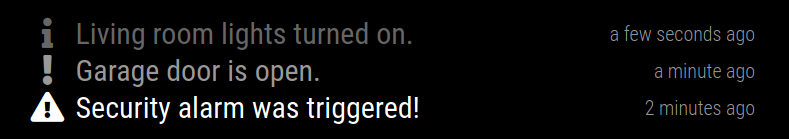

# MMM-HomeAutomationNotifications

A [MagicMirror²](https://github.com/MichMich/MagicMirror) module to display home automation notifications. Notifications are sent to the module using a simple HTTP POST call.

Based on the [MMM-syslog](https://github.com/paviro/MMM-syslog) module by Paul-Vincent Roll (paviro).

This module is the counterpart to my [Hubitat Elevation](https://hubitat.com) notification driver named [HTTP Notifications](https://github.com/john3300/Hubitat-HTTPNotifications) for sending notifications. However the implementation is not specific to Hubitat and can be used for any kind of notification.

## Screenshots



## Installation

1. Navigate into your `MagicMirror/modules` directory and execute `git clone https://github.com/john3300/MMM-HomeAutomationNotifications.git`

## Using the module

To use this module, add it to the modules array in the `config/config.js` file:
``` js
modules: [
    {
        module: "MMM-HomeAutomationNotifications",
        position: "bottom_bar",	// This can be any of the regions.
        config: {
            // The config property is optional.
            // See 'Configuration options' for more information.
        }
    }
]
```

You will also need to ensure that your global configuration entry for `address` is set to listen on the correct interface. The `ipWhiteList` should also contain the IP address of your home automation server that will be sending the requests. Without both of these items MagicMirror will refuse the requests.

Notifications can be sent to the module with an HTTP POST request to this URL:
`POST http://<SERVER-ADDRESS>:<PORT>/MMM-HomeAutomationNotifications?type=<TYPE>&message=<MESSAGE>`

`type` has three possible values:
- INFO
- WARNING
- ERROR

`message` must be URL encoded if it contains any special characters such as a space.

Example request:
`POST http://magicmirror:8080/MMM-HomeAutomationNotifications?type=WARNING&message=Front%20door%20unlocked`

The server will respond to the request with an ID value for the notification that was created. This value can be used in subsequent requests to update or delete the notification.

A notification can be updated with an HTTP PUT request to this URL:
`PUT http://<SERVER-ADDRESS>:<PORT>/MMM-HomeAutomationNotifications?id=<ID>&type=<TYPE>&message=<MESSAGE>`

A notificaiton can be deleted with an HTTP DELETE request to this URL:
`DELETE http://<SERVER-ADDRESS>:<PORT>/MMM-HomeAutomationNotifications?id=<ID>`

## Configuration options

The following properties can be configured:
|Option|Description|
|--|--|
|`max`|The maximum number of notifications to display.<br/><br/>**Default value:** `5`|
|`duration`|How long each notification should be displayed. (Minutes)<br/><br/>**Default value:** `30`|
|`animationSpeed`|Speed of the update animation. (Milliseconds)<br/><br/>**Possible values:** `0` - `5000`<br/>**Default value:** `2500` (2.5 seconds)|

